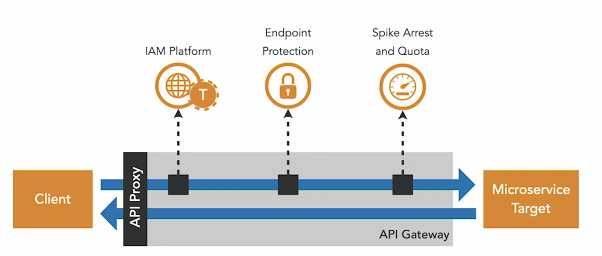

# Security in Microservices 

**What is microservice?**   
service that is built, deployed and scaled as a single responsibility which can communicate between other similar services over a network.    

### Authentication 
Establish Identity Globally 
example : aadhar card to establish citizenship of india 

### Authorization
Establish Role access and verify access priviledge 
example : boarding pass for a flight
    there are hundreds of flights available. user is authorize to only board the flight for which he has the boarding pass. otherwise user cannot board the flight

### Difference between authentication and authorization 
Authentication occurs on a user level. it questions the identity of a user. for example, access token for API. only validated users can access API. 
Authorization occurs on a module level. for example, in an access token it is mentioned for which users the module is accessible.

## Attack surface
Ways in which data gets into or out of the application

1. Open Ports
2. Databases
3. User interface 
4. API

Monoliths have limited attack surfaces. Since everything is in one domain. user domain can be accessed throughout the internal services.

Microservices have wide attack surface. 
- Since each service is exposes a port to communcate between each other. 
- Managing user identity across multiple microservices
- Publically exposed apis are prone to DDoS
- Data is flowed through multiple services risking its exposure
  

## API Gateway

It acts as a reverse proxy. All the public traffic goes through the api gateway first. it authorizes, validates the request and then sent to the microservice layer. It also provides monitoring and visibility. 

# OAuth 2.0: Four Key Roles  

## 1. Resource Owner  
- **Who?** The user (or entity) that owns the protected resources.  
- **Role:** Grants permission to access their resources.  
- **Example:** A user allowing a third-party app to access their Google Drive files.  

## 2. Client  
- **Who?** The application that wants to access the user's resources.  
- **Role:** Requests an access token from the authorization server on behalf of the resource owner.  
- **Example:** A mobile app or web application requesting access to the user’s data on another platform.  

## 3. Authorization Server  
- **Who?** The server that issues access tokens.  
- **Role:** Authenticates the resource owner, validates permissions, and provides an access token to the client.  
- **Example:** Google's OAuth server when you log in with Google on a third-party website.  

## 4. Resource Server  
- **Who?** The API or service that holds the user 's protected resources.  
- **Role:** Validates access tokens and provides access to the requested resources.  
- **Example:** Google Drive API verifying the access token before allowing access to files.  

# Logging Between Microservices

Since microservices are distributed in the network, there is no way of tracking an event end-to-end.
Hence, Each Microservice level, logs should have a correlation Id from which an entire event could be reconstructed.
Then this correlation id can tracked using a log aggregrator which is a centralized entity where all the logs are persisted and can be searched. (ex. ELK stack)
This improves Debugging as well as Security Auditing.
Logs should include Failure events and successful event.

# Service Mesh 

requires the MS to be containerised and deployed via container orchestration service
each MS is deployed with a proxy container (also known as side car). this allows intercepting the traffic between MS.

side car allows to enforce policies for a MS like authorization and authentication evenbefore reaching to a MS
without making any changes in a MS code.
Pilot controls the usage of proxies. citadel provides mTLS between MS

# Throttling and Rate limiting

Throttling = control the API usage by clients. it is better to deny some traffic to preserve the existing usage than to crash the whole thing for all clients.
Rate Limiting  = Measured in trasaction per seconds and limits a burst concurrent calls in a short timeframe  
Quota = number of calls allowed by the client in a longer interval. Often used in monetized APIs  

# Security Tools
- Docker Bench = used to secure your containers deployed on your VMs 
- Sneak
- credential scanner GitLeaks to scan credentials in your code 
- 

# Container Security 
- Use a thin base image
- Use Least priviledge to create containers 
- Use base image from a trusted source and always use latest images to build your containers

# Ideal Way to get your code to production 

Read more about OAuth 2.0 https://www.oauth.com/
