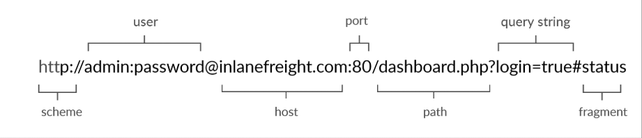

# URL
Resources over HTTP are accessed via a URL, which offers many more specifications than simply specifying a website we want to visit. Let's look at the structure of a URL:

| Component    | Example           | Description                                                                                                                          |
| ------------ | ----------------- | ------------------------------------------------------------------------------------------------------------------------------------ |
| Scheme       | http://, https:// | Identifies the protocol being accessed by the client and ends with `://`.                                                            |
| User Info    | admin:password@   | Optional component containing credentials (separated by `:`) used to authenticate to the host, and separated from the host with `@`. |
| Host         | inlanefreight.com | Signifies the resource location. This can be a hostname or an IP address.                                                            |
| Port         | :80               | Separated from the host by `:`. If no port is specified, HTTP defaults to port 80 and HTTPS defaults to port 443.                    |
| Path         | /dashboard.php    | Points to the resource being accessed (file or folder). If not specified, the server returns the default index (e.g., `index.html`). |
| Query String | ?login=true       | Starts with `?` and consists of parameters and values. Multiple parameters are separated by `&`.                                     |
| Fragment     | #status           | Processed by the browser on the client side to locate sections within the primary resource.                                          |


Our browsers usually first look up records in the local '/etc/hosts' file, and if the requested domain does not exist within it, then they would contact other DNS servers. We can use the '/etc/hosts' to manually add records to for DNS resolution, by adding the IP followed by the domain name.


# cURL

cURL (client URL) is a command-line tool and library that primarily supports HTTP along with many other protocols.  

- -o : save output in a file with user-defined name
- -O : save output in a file with server-defined name
- -s : silent output
- -k : skip the certificate   
- -v : verbose (show http request and response headers/body)
- -vvv : extra fucking verbose (-v but extra)
- -I : send a HEAD Request and display only the response headers.
- -i : display both response headers and body
- -A : set our `User-Agent`
- -u : provide credentials like `admin:admin`
- -H : set an header, usage : `-H 'Authorization: Basic YWRtaW46YWRtaW4='`
- -L : follow the redirection sent by the user 
- -X : set method
- -d : set body content in case of post request 
- -b : set cookie in the request (alternative : `-H 'Cookie : </cookie_value/>'`)
- -h : help


For documentation : 
```
man curl 
```